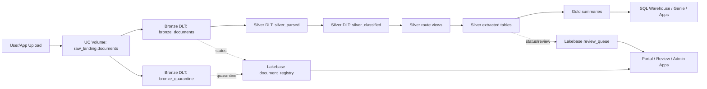

# DocuBricks System Specification

## Purpose

DocuBricks is a Databricks-native document intelligence accelerator for regulated document workflows. It ingests raw documents from Unity Catalog Volumes, parses and classifies them with Databricks AI functions, extracts structured fields into Delta tables, tracks operational state in Lakebase, and exposes onboarding, portal, review, and admin user interfaces through Databricks Apps.

This specification describes the current codebase as implemented. It also calls out configuration risks where the repository intent and implementation are not fully aligned.

## Functional Scope

### Primary Capabilities

- Ingest binary documents from a Unity Catalog Volume with Auto Loader.
- Derive document identity using SHA-256 content hashing.
- Partition documents by tenant and vertical using the landing path convention.
- Quarantine unsupported, empty, malformed, or low-confidence records.
- Parse documents with the Databricks native `ai_parse_document` SQL function.
- Classify parsed text with the Databricks native `ai_classify` SQL function.
- Route supported document types to document-specific extractor tables.
- Extract structured fields with the Databricks native `ai_extract` SQL function.
- Maintain Lakebase operational state for document registry, review queue, reprocessing queue, extraction audit, alerts, tenants, and onboarding sessions.
- Materialize Gold summary tables for Financial Services analytics and platform health.
- Provide Databricks Apps for onboarding, document upload/status, Genie chat, human review, and administration.
- Bootstrap Unity Catalog, Lakebase migrations, schema registry metadata, Lakehouse Monitoring, Genie, and Vector Search.
- Validate repository readiness, schema asset coverage, unit tests, integration tests, and Databricks bundle deployment through scripts and GitHub Actions.

### Supported Verticals and Document Types

The schema asset library currently contains:

| Vertical | Document Types |
|---|---|
| `fs` | `mortgage_application`, `kyc_cdd_form`, `aml_sar`, `invoice` |
| `healthcare` | `eob_cms1500`, `clinical_note_soap`, `lab_report`, `prior_auth` |
| `legal` | `nda_msa`, `sow`, `regulatory_submission`, `court_filing` |

The implemented Silver extractor pipeline currently includes Financial Services extractors:

- `silver_extracted_mortgage_application`
- `silver_extracted_kyc_cdd_form`
- `silver_extracted_aml_sar`
- `silver_extracted_invoice`

Healthcare and legal schema assets exist, but extractor pipeline implementations for those verticals are not currently wired into the processing DLT resource.

## Repository Structure

| Path | Purpose |
|---|---|
| `databricks.yml` | Databricks Asset Bundle root config, variables, targets, includes, and inline pipeline resources. |
| `resources/pipelines/` | Pipeline resource definitions for ingestion, processing, and Gold layers. |
| `resources/jobs/bootstrap/` | Bootstrap Workflow job definitions. |
| `resources/jobs/ops/` | Operational Workflow job definitions. |
| `resources/apps/` | Databricks App resource definitions. |
| `src/pipelines/bronze/` | Bronze ingestion DLT notebook source. |
| `src/pipelines/silver/` | Parsing, classification, routing, and extraction DLT notebook sources. |
| `src/pipelines/gold/` | Gold analytics and health DLT notebook sources. |
| `src/bootstrap/` | Bootstrap scripts run as Databricks Workflow tasks. |
| `src/ops/` | Operational jobs for health checks, stale recovery, and schema tests. |
| `src/agents/` | Domain-specific agent jobs for FS, healthcare, and legal workflows. |
| `apps/lib/` | Shared Streamlit app helpers for auth, Lakebase, SQL Warehouse, Databricks APIs, Genie, telemetry, and theme. |
| `apps/onboarding/` | Streamlit onboarding app and local state machine. |
| `apps/portal/` | Streamlit end-user portal. |
| `apps/review/` | Streamlit human review app. |
| `apps/admin/` | Streamlit admin and schema management app. |
| `apps/onboarding-web/` | React/Vite onboarding prototype. |
| `Schemas/` | Prompt, validation, model routing, field threshold, and golden-test assets by vertical/document type. |
| `migrations/` | Lakebase PostgreSQL migrations. |
| `scripts/` | Local readiness and schema asset validation scripts. |
| `tests/` | Unit, integration, and end-to-end tests. |
| `.github/workflows/` | CI, integration, and release automation. |
| `docs/` | User and operator documentation. |

## Architecture

### High-Level Data Flow



### Storage Layers

#### Raw Landing

Documents are uploaded into a managed Unity Catalog Volume:

```text
/Volumes/{catalog_name}/raw_landing/documents/{tenant_id}/{vertical}/{document_id}.{file_ext}
```

The shared app helper `apps/lib/databricks_api.py` currently hard-codes this root as:

```text
/Volumes/docubricks_prod/raw_landing/documents
```

That means non-prod targets should either override this behavior before deployment or ensure app uploads target the intended catalog.

#### Bronze

`src/pipelines/bronze/autoloader_ingest.py` uses Auto Loader with `binaryFile` format to produce:

- `bronze_documents`
- `bronze_quarantine`
- internal DLT views `_bronze_quarantine_pending` and `_bronze_documents_pending`

`bronze_documents` includes:

- `document_id`
- `tenant_id`
- `vertical`
- `file_ext`
- `source_path`
- `file_size_bytes`
- `source_modified_at`
- `content`
- `ingested_at`

Quality expectations:

- `document_id` must be non-null.
- file length must be greater than zero.
- vertical must be one of `fs`, `healthcare`, `legal`, `manufacturing`, `insurance`, `real_estate`.
- file extension must be one of `pdf`, `docx`, `doc`, `png`, `jpg`, `jpeg`, `tiff`, `tif`, `html`, `htm`.
- tenant ID presence is monitored.
- files larger than 500 MB are monitored.

The Bronze code contains Lakebase status helper functions, but DLT side-effect writes are constrained and not fully attached as executable `foreachBatch` queries in the current notebook.

#### Silver Parse and Classify

`src/pipelines/silver/parse_classify.py` produces:

- `silver_parsed`
- `silver_classified`
- `silver_classification_review`

`silver_parsed`:

- reads from `bronze_documents`
- calls `ai_parse_document(content)`
- stores parsed text, page count, layout JSON, parse status, and parse errors
- drops raw binary content from downstream tables

`silver_classified`:

- loads active classification labels from `{catalog}.schema_registry.document_type_labels`
- falls back to a hard-coded label set if the registry is unavailable
- calls `ai_classify(parsed_text, array(...labels...))`
- retains only rows with `classification_confidence >= 0.70`

`silver_classification_review`:

- separately captures rows with null document type or confidence below `0.70`
- is intended to feed human review workflows

#### Silver Routing

`src/pipelines/silver/extract_router.py` defines route views:

- `silver_route_mortgage_application`
- `silver_route_kyc_cdd_form`
- `silver_route_aml_sar`
- `silver_route_invoice`

It also defines:

- `silver_routing_audit`
- `silver_unrouted`

The route views are logical DLT views. The extracted tables materialize the routed document subsets.

#### Silver Extraction

`src/pipelines/silver/extractors/_base.py` defines the shared extraction contract:

- read `dlt.read_stream("silver_route_{document_type}")`
- load prompt from `{catalog}.schema_registry.extraction_prompts`
- call `ai_extract(parsed_text, prompt)`
- unpack `result`, `avg_confidence`, and `field_scores`
- flatten JSON into typed columns using a document-specific flattener
- apply standard Delta table properties
- update Lakebase status and review queues through `LakbaseHelper`

Current document-specific extractors:

| File | Table | Drop Threshold | Review Threshold |
|---|---|---:|---:|
| `mortgage_application.py` | `silver_extracted_mortgage_application` | 0.60 | 0.80 |
| `kyc_cdd_form.py` | `silver_extracted_kyc_cdd_form` | 0.65 | 0.87 |
| `aml_sar.py` | `silver_extracted_aml_sar` | 0.70 | 0.90 |
| `invoice.py` | `silver_extracted_invoice` | 0.60 | 0.75 |

Note: the shared helper class is named `LakbaseHelper` in the current code. This typo is part of the current API and is imported by the extractors.

#### Gold

`src/pipelines/gold/fs_portfolio.py` defines Financial Services Gold tables:

- `fs_mortgage_portfolio`
- `fs_kyc_compliance_summary`
- `fs_aml_alerts_summary`

`src/pipelines/gold/platform_health.py` defines:

- `platform_health`

Gold tables read fully qualified Silver tables with `spark.table(...)` rather than DLT streams, so Gold can be refreshed independently from Silver.

## Lakebase Data Model

Lakebase is used as the operational database. Migrations are stored in `migrations/`.

| Migration | Tables |
|---|---|
| `V001__create_document_registry.sql` | `document_registry` |
| `V002__create_processing_jobs.sql` | `processing_jobs` |
| `V003__create_review_queue.sql` | `review_queue` |
| `V004__create_reprocessing_queue.sql` | `reprocessing_queue` |
| `V005__create_extraction_audit.sql` | `extraction_audit` |
| `V006__create_monitoring_alerts.sql` | `monitoring_alerts` |
| `V007__create_tenant_registry.sql` | `tenant_registry`, `tenant_reviewer_assignments`, `tenant_users`, `onboarding_sessions` |
| `V008__create_schema_library_tables.sql` | `schema_inheritance` |

### Document Registry Statuses

`document_registry.status` is constrained to:

- `RECEIVED`
- `PARSING`
- `PARSED`
- `CLASSIFYING`
- `CLASSIFIED`
- `EXTRACTING`
- `EXTRACTED`
- `VALIDATED`
- `REVIEW`
- `COMPLETE`
- `FAILED`
- `QUARANTINE`

### Review Queue Reasons

`review_queue.review_reason` is constrained to:

- `LOW_CONFIDENCE`
- `CLASSIFICATION_AMBIGUOUS`
- `SCHEMA_VIOLATION`
- `HUMAN_FLAGGED`

### Tenant Roles

`tenant_users.role` supports:

- `viewer`
- `reviewer`
- `admin`

The apps enforce this hierarchy through `apps/lib/auth.py`.

## Databricks Asset Bundle Configuration

### Bundle Variables

`databricks.yml` defines:

| Variable | Default | Purpose |
|---|---|---|
| `catalog_name` | `docubricks_prod` | Unity Catalog catalog name. |
| `tier` | `community` | Schema bundle tier: `community`, `starter`, `professional`, `enterprise`. |
| `secret_scope` | `docubricks-prod` | Databricks Secret scope for Lakebase, tokens, SQL Warehouse, and IDs. |
| `otel_endpoint` | empty | Optional OpenTelemetry collector endpoint. |
| `enable_agents` | `false` | Intended feature flag for vertical agent workflows. |
| `vertical` | `fs` | Primary vertical. |
| `sql_warehouse_id` | empty | Serverless SQL warehouse ID for Genie and Gold queries. |

### Bundle Targets

| Target | Mode | Catalog | Agents | Workspace Root |
|---|---|---|---|---|
| `dev` | development | `docubricks_dev` | `false` | `/Workspace/Users/${workspace.current_user.userName}/.bundle/docubricks` |
| `staging` | default | `docubricks_staging` | `true` | `/Workspace/.bundle/docubricks-staging` |
| `prod` | production | `docubricks_prod` | `true` | `/Workspace/.bundle/docubricks-prod` |

The `prod` target uses `run_as.service_principal_name: docubricks-prod-sp`.

### Included Resources

The root bundle includes:

- `resources/pipelines/*.yml`
- `resources/jobs/bootstrap/*.yml`
- `resources/jobs/ops/*.yml`
- `resources/apps/*.yml`

Current config risk: `databricks.yml` also defines `ingestion_pipeline`, `processing_pipeline`, and `gold_pipeline` inline under `resources`, while the included files define resources with the same keys. This can cause duplicate or overriding resource definitions depending on Databricks Asset Bundle merge behavior and CLI version. The intended source of truth should be made explicit.

### Compute Model

Pipeline resources use serverless DLT:

- `serverless: true`
- `channel: PREVIEW`
- `continuous: false`

Bootstrap and ops job resources currently use classic `new_cluster` definitions with `spark_version: 15.4.x-scala2.12`, `node_type_id: Standard_DS3_v2`, and `num_workers: 0`. This is incompatible with Databricks Free Edition, which is serverless-only.

## Bootstrap and Operational Jobs

### Bootstrap Jobs

| Bundle Resource | Resource File | Script | Function |
|---|---|---|---|
| `bootstrap_00_setup_uc` | `resources/jobs/bootstrap/00_setup_uc.yml` | `src/bootstrap/setup_unity_catalog.py` | Creates catalog, schemas, volumes, and RLS helper function. |
| `bootstrap_01_schema_registry` | `resources/jobs/bootstrap/01_schema_registry.yml` | `src/bootstrap/setup_schema_registry.py` | Creates and loads schema registry assets. |
| `bootstrap_02_load_schemas` | `resources/jobs/bootstrap/02_load_schemas.yml` | `src/bootstrap/setup_schema_registry.py` | Duplicate schema registry loader job. |
| `bootstrap_03_monitoring` | `resources/jobs/bootstrap/03_monitoring.yml` | `src/bootstrap/setup_monitoring.py` | Creates Lakehouse Monitoring quality monitors. |
| `bootstrap_04_genie` | `resources/jobs/bootstrap/04_genie.yml` | `src/bootstrap/setup_genie.py` | Creates Genie space and seed questions. |
| `bootstrap_05_vector_search` | `resources/jobs/bootstrap/05_vector_search.yml` | `src/bootstrap/setup_vector_search.py` | Creates Vector Search endpoint and Delta Sync Index. |

The repo also contains `src/bootstrap/setup_lakebase.py`, but no `resources/jobs/bootstrap/*.yml` file currently maps to it. The Lakebase migration runner applies `V001` through `V007`; it does not include `V008` in `MIGRATION_ORDER`.

### Operational Jobs

| Resource File | Script | Function |
|---|---|---|
| `resources/jobs/ops/schema_test_harness.yml` | `src/ops/schema_test_harness.py` | Runs golden tests for candidate prompts and promotes versions if accuracy passes threshold. |
| `resources/jobs/ops/daily_health_check.yml` | `src/ops/daily_health_check.py` | Checks quarantine rate, average confidence, review SLA, and stale documents; writes alerts. |
| `resources/jobs/ops/stale_doc_recovery.yml` | `src/ops/stale_doc_recovery.py` | Finds stale docs, marks them failed, and queues reprocessing. |

### Agent Jobs

Agent resource files exist under `resources/jobs/agents/`, but `databricks.yml` does not currently include that directory. Therefore, these jobs are not deployed by the current bundle include list.

Agent source files:

- `src/agents/fs/mortgage_risk_monitor.py`
- `src/agents/fs/kyc_refresh.py`
- `src/agents/fs/aml_pattern.py`
- `src/agents/legal/contract_expiry.py`
- `src/agents/healthcare/eob_reconciliation.py`

These jobs primarily read Gold/Silver tables and write Lakebase review or monitoring records.

## Application Structure

### Shared App Library

| Module | Responsibility |
|---|---|
| `apps/lib/auth.py` | Reads Databricks Apps `X-Forwarded-User`, resolves tenant/user role from Lakebase, enforces role hierarchy. |
| `apps/lib/lakebase.py` | Streamlit-cached psycopg2 pool plus `lb_query`, `lb_exec`, and `lb_exec_returning`. |
| `apps/lib/sql_warehouse.py` | Streamlit-cached Databricks SQL connector plus row and DataFrame query helpers. |
| `apps/lib/databricks_api.py` | Files API upload, Jobs API run-now, and Jobs Runs API status wrappers. |
| `apps/lib/genie.py` | Blocking wrapper for Databricks AI/BI Genie conversations. |
| `apps/lib/otel.py` | OpenTelemetry helper module. |
| `apps/lib/theme.py` | Shared Streamlit theme setup. |
| `apps/lib/components/` | Reusable Streamlit UI components. |

### Onboarding App

Path: `apps/onboarding/`

Current implementation:

- Streamlit app.
- Uses `apps/onboarding/core/state.py`.
- Stores local state in `.docubricks_onboarding_state.json`.
- Implements screen progression through:
  - `WELCOME`
  - `PROJECT`
  - `VERTICAL`
  - `WORKSPACE`
  - `RESOURCES`
  - `REVIEW`
  - `DEPLOYING`
  - `FIRST_DOC`
  - `COMPLETE`
- Tracks deployment steps such as workspace verification, service principal creation, schema upload, DLT pipeline creation, Lakebase provisioning, Genie, Vector Search, app deployment, secret writing, and health check.

This app is currently a demo/provisioning-state shell rather than a complete provisioning engine.

### Portal App

Path: `apps/portal/`

Pages:

- `Upload`
- `Status`
- `Ask DocuBricks`
- `Dashboard`

Key behavior:

- Authenticates via Databricks Apps header.
- Resolves tenant and role from Lakebase.
- Uploads files to UC Volumes with `upload_to_volume`.
- Registers documents in Lakebase with `lb_exec_returning`.
- Triggers the main Databricks pipeline job with `trigger_pipeline`.
- Shows document status from Lakebase and extracted fields from SQL Warehouse.
- Asks Genie questions through `ask_genie`.
- Displays dashboards using Gold tables.

### Review App

Path: `apps/review/`

Pages:

- `Queue`
- `History`

Key behavior:

- Requires at least `reviewer` role.
- Displays unresolved `review_queue` items by tenant.
- Provides review history and field-level diff views.
- Reads original extractions through SQL Warehouse and queue state through Lakebase.

### Admin App

Path: `apps/admin/`

Pages:

- `Schema Manager`
- `Accuracy Trends`
- `Tenant Onboarding`
- `Job Monitor`

Key behavior:

- Requires `admin` role.
- Manages prompt versions and schema promotion workflows.
- Starts schema test harness jobs.
- Displays extraction metrics and low-confidence field trends.
- Creates tenants, tenant users, and reviewer assignments.
- Runs tenant smoke tests.
- Monitors pipeline/job state.

### React Onboarding Prototype

Path: `apps/onboarding-web/`

Tech stack:

- React 19
- Vite 8
- TypeScript 6
- Zustand
- React Router
- Tailwind CSS
- lucide-react
- Playwright dev dependency

This app is separate from the Databricks Apps Streamlit onboarding app. It includes typed API interfaces, mock and Databricks API adapters, screens, components, and shared state.

## External Dependencies

### Databricks Platform Dependencies

- Unity Catalog
- Unity Catalog managed Volumes
- Delta Live Tables / Lakeflow Declarative Pipelines
- Serverless DLT
- Databricks SQL Warehouse
- Databricks Apps
- Databricks Files API
- Databricks Jobs API
- Databricks AI functions:
  - `ai_parse_document`
  - `ai_classify`
  - `ai_extract`
  - `ai_query`
- Lakebase PostgreSQL-compatible database
- AI/BI Genie
- Mosaic AI Vector Search
- Lakehouse Monitoring
- Databricks Secret scopes

### Python Dependencies

App-level requirements:

- `streamlit`
- `psycopg2-binary`
- `databricks-sql-connector`
- `databricks-sdk`
- `opentelemetry-api`
- `opentelemetry-sdk`
- `opentelemetry-exporter-otlp-proto-grpc`
- `httpx`
- `requests`
- `pandas`
- `altair`

Pipeline and job code assumes Databricks Runtime provides:

- `dlt`
- `pyspark`
- `dbutils`
- `spark`

Local test/CI tooling referenced by workflows:

- `pytest`
- `pytest-cov`
- `ruff`
- `mypy`
- `types-psycopg2`
- `pandas-stubs`

Current dependency risk: `.github/workflows/*.yml` install `-r requirements.txt`, but there is no root `requirements.txt` in the repository. App-specific requirements files exist under `apps/*/requirements.txt`.

### Frontend Dependencies

`apps/onboarding-web/package.json` dependencies:

- `react`
- `react-dom`
- `react-router-dom`
- `zustand`
- `lucide-react`
- `clsx`
- `tailwind-merge`

Development dependencies include:

- `typescript`
- `vite`
- `eslint`
- `typescript-eslint`
- `tailwindcss`
- `postcss`
- `autoprefixer`
- `playwright`

## Configuration and Secrets

### Local Environment Variables

`.env.example` defines:

| Variable | Purpose |
|---|---|
| `DATABRICKS_HOST` | Workspace URL. |
| `DATABRICKS_TOKEN` | PAT or service principal token. |
| `DATABRICKS_TARGET` | Bundle target. |
| `CATALOG_NAME` | Unity Catalog catalog override. |
| `SCHEMA_TIER` | Schema bundle tier. |
| `LAKEBASE_CONN` | PostgreSQL connection string for Lakebase. |
| `SECRET_SCOPE` | Databricks Secret scope. |
| `SQL_WAREHOUSE_ID` | SQL Warehouse ID. |
| `SQL_WH_HTTP_PATH` | SQL Warehouse HTTP path. |
| `OTEL_EXPORTER_OTLP_ENDPOINT` | Optional telemetry endpoint. |
| `OTEL_SERVICE_NAME` | Telemetry service name. |
| `ENABLE_AGENTS` | Agent feature flag. |
| `VERTICAL` | Primary vertical. |

### Databricks Secret Scope Keys

The code uses multiple naming conventions. Current references include:

- `lakebase-conn-string`
- `databricks-token`
- `databricks-host`
- `databricks-sp-token`
- `sql-wh-http-path`
- `pipeline-job-id`
- `genie-space-id-fs`
- `DATABRICKS_HOST`
- `DATABRICKS_TOKEN`
- `LAKEBASE_CONN`
- `SQL_WH_HTTP_PATH`
- `GENIE_SPACE_ID_FS`
- `PIPELINE_JOB_ID`

Configuration risk: app YAML files and Python modules do not use one consistent secret key naming scheme. Standardizing lowercase/hyphenated or uppercase/underscore keys would reduce deployment failures.

## Schema Registry

Schema artifacts are stored under:

```text
Schemas/{vertical}/{document_type}/
```

Required files:

- `prompt_v1.txt`
- `validation_rules.json`
- `field_thresholds.json`
- `model_routing.json`
- `golden_tests/test_*.json`

`scripts/validate_schema_assets.py` currently validates:

- all FS document types
- all Healthcare document types
- JSON validity
- minimum FS golden corpus total of 50
- minimum Healthcare golden corpus of 5 per type

Current validation result during this documentation pass:

- FS document types: 20 golden tests each.
- Healthcare document types: 5 golden tests each.
- schema asset coverage passed.

The schema registry loader creates Delta tables:

- `extraction_prompts`
- `validation_rules`
- `field_confidence_thresholds`
- `schema_model_routing`
- `document_type_labels`
- `schema_changelog`
- `schema_inheritance`

Naming risk: `setup_schema_registry.py` creates `extraction_prompts.doc_type`, while `get_extraction_prompt()` in `_base.py` filters on `document_type`. This mismatch should be resolved before relying on prompt lookup at runtime.

## Testing and Validation

### Local Scripts

| Command | Purpose |
|---|---|
| `python3 scripts/check_readiness.py` | Checks minimum Phase 0 repo paths. |
| `python3 scripts/validate_schema_assets.py` | Validates schema asset coverage and JSON validity. |

Current local results during this documentation pass:

- `python3 scripts/check_readiness.py` passed.
- `python3 scripts/validate_schema_assets.py` passed.

### Unit Tests

Unit tests cover:

- readiness inventory
- schema asset coverage
- Lakebase helper behavior
- onboarding state machine
- confidence routing
- schema inheritance and prompt resolution

### Integration Tests

`tests/integration/test_lakebase_lifecycle.py` validates Lakebase lifecycle behavior and requires `LAKEBASE_CONN`.

### End-to-End Smoke Test

`tests/e2e/smoke_test.py` is designed to:

- upload a sample mortgage PDF to the UC Volume
- trigger the Databricks pipeline
- poll processing status
- query output tables
- ask a Genie question

It requires Databricks host/token, SQL Warehouse path, Lakebase connection, pipeline job ID, Genie space ID, and catalog name.

### CI/CD

`.github/workflows/ci.yml`:

- ruff lint
- ruff format check
- mypy
- unit tests
- Databricks bundle validate

`.github/workflows/integration.yml`:

- bundle validate and deploy to dev
- run bootstrap jobs
- run integration tests

`.github/workflows/release.yml`:

- staging deploy
- staging bootstrap
- staging E2E
- manual production gate
- production deploy/bootstrap

Current CI risk: workflows install from a missing root `requirements.txt`.

## Security and Multi-Tenancy

### Identity

Databricks Apps are expected to inject `X-Forwarded-User`. `apps/lib/auth.py` reads this header through `st.context.headers` and stops execution if it is missing.

### Authorization

Tenant and role authorization is Lakebase-backed:

- `tenant_users` maps users to tenants and roles.
- `resolve_tenant()` finds the active tenant for a user.
- `require_role()` enforces role hierarchy.

### Row-Level Security

`src/bootstrap/setup_unity_catalog.py` creates a placeholder row filter function:

```sql
silver.rls_tenant_filter(tenant_id STRING)
```

It prints the `ALTER TABLE ... SET ROW FILTER ...` statements to bind RLS after DLT tables exist. The binding is not automatically applied in the current bootstrap script.

### Secrets

Secrets should be stored in Databricks Secret scopes and injected into apps/jobs. Local `.env` values are for development only and should not be committed.

## Known Implementation and Configuration Risks

1. `databricks.yml` defines pipelines inline while also including `resources/pipelines/*.yml` with the same resource keys.
2. `resources/jobs/agents/*.yml` exists but is not included in the root bundle include list.
3. `src/bootstrap/setup_lakebase.py` is not mapped by any bootstrap job resource.
4. `setup_lakebase.py` applies only `V001` through `V007`, while `V008__create_schema_library_tables.sql` exists.
5. Bootstrap and ops jobs use classic `new_cluster` compute, which is not compatible with serverless-only Databricks Free Edition.
6. App upload code hard-codes `/Volumes/docubricks_prod/...`, which conflicts with `dev` and `staging` catalog targets.
7. Secret key naming is inconsistent across bundle resources, app manifests, and Python code.
8. `extraction_prompts` schema uses `doc_type`, while `_base.py` prompt lookup filters on `document_type`.
9. Gold Genie trusted tables include names such as `extraction_metrics_daily` and `agent_activity` that are referenced in `setup_genie.py` but are not defined by the current Gold pipeline files.
10. Lakehouse Monitoring script lists `silver_route_*` views but uses `extracted_at` as the timestamp column; route views emit `routed_at`, not `extracted_at`.
11. CI workflows require a root `requirements.txt`, but none exists.
12. The shared extraction helper and extractors use the typo `LakbaseHelper`.
13. RLS function creation exists, but RLS attachment is manual.
14. The onboarding Streamlit app currently advances demo state and does not execute full provisioning.

## Deployment Preconditions

A full deployment requires:

- Databricks CLI installed and authenticated.
- Workspace with Unity Catalog enabled.
- Permissions to create catalogs, schemas, volumes, DLT pipelines, jobs, apps, Genie spaces, Vector Search endpoints, and Lakehouse Monitoring assets.
- Lakebase instance and reachable connection string.
- Secret scope with required keys.
- SQL Warehouse and HTTP path.
- Foundation Model / AI functions enabled.
- Databricks Apps enabled.
- Vector Search enabled.
- Genie enabled.

For Databricks Free Edition, only a reduced smoke target is viable unless Lakebase, classic job clusters, and unsupported services are skipped or replaced.

## Recommended Next Specification Tasks

1. Split the bundle into explicit `dev`, `free_dev`, `staging`, and `prod` resource sets.
2. Make one resource source of truth for pipeline definitions.
3. Add a root dependency file or update CI to install from app-specific requirements.
4. Standardize secret names across bundle resources and Python modules.
5. Wire Lakebase migration bootstrap into `resources/jobs/bootstrap/`.
6. Include `V008` in migration ordering or remove it from readiness expectations until implemented.
7. Resolve `doc_type` versus `document_type` registry naming.
8. Parameterize app upload volume root by catalog.
9. Decide whether agent jobs are in scope for `dev` and add bundle includes or remove stale resources.
10. Add a Free Edition smoke-test target if Databricks Free Edition support is a goal.
